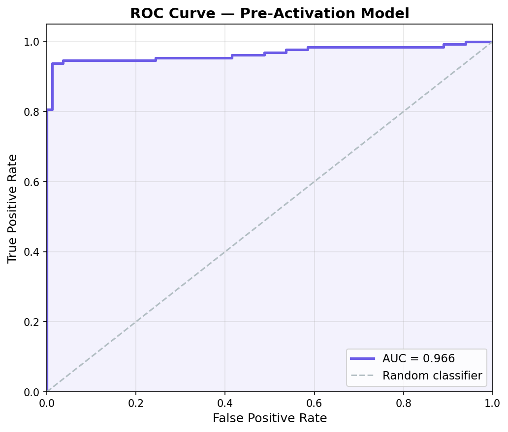
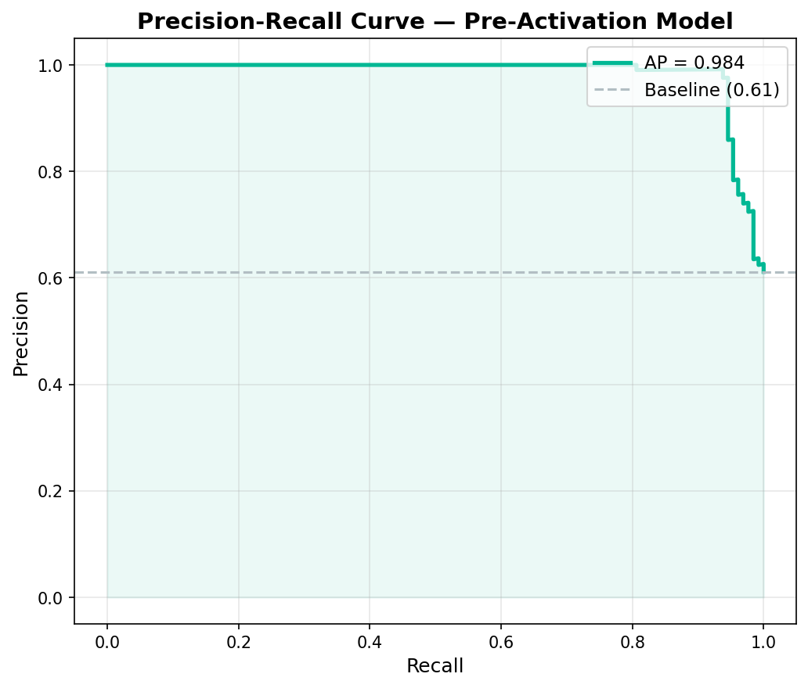
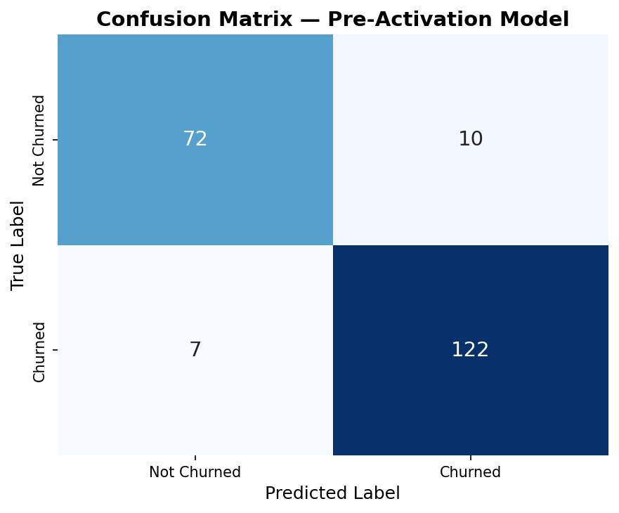
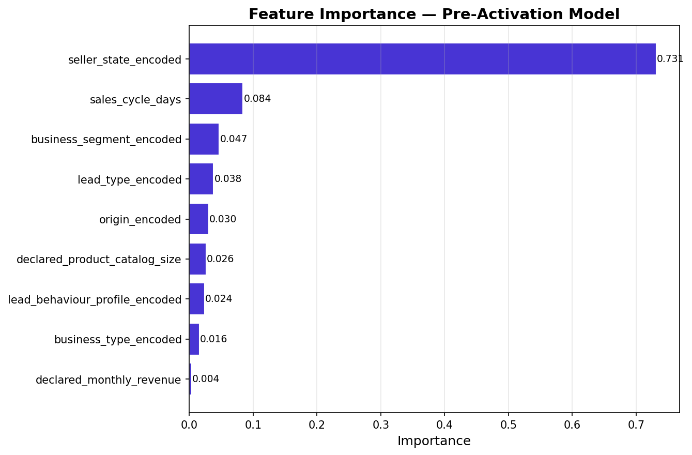
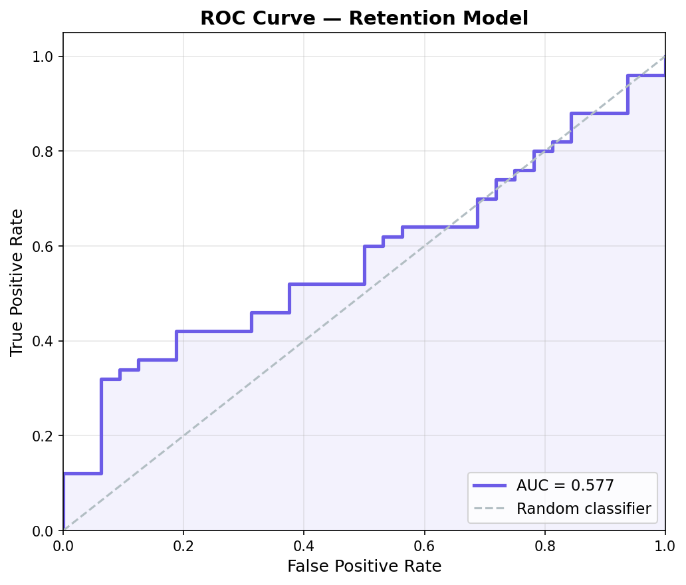
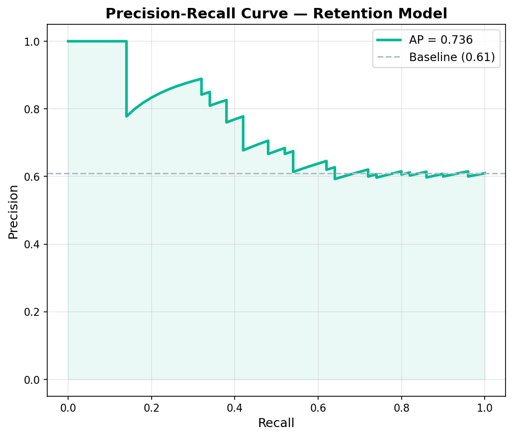
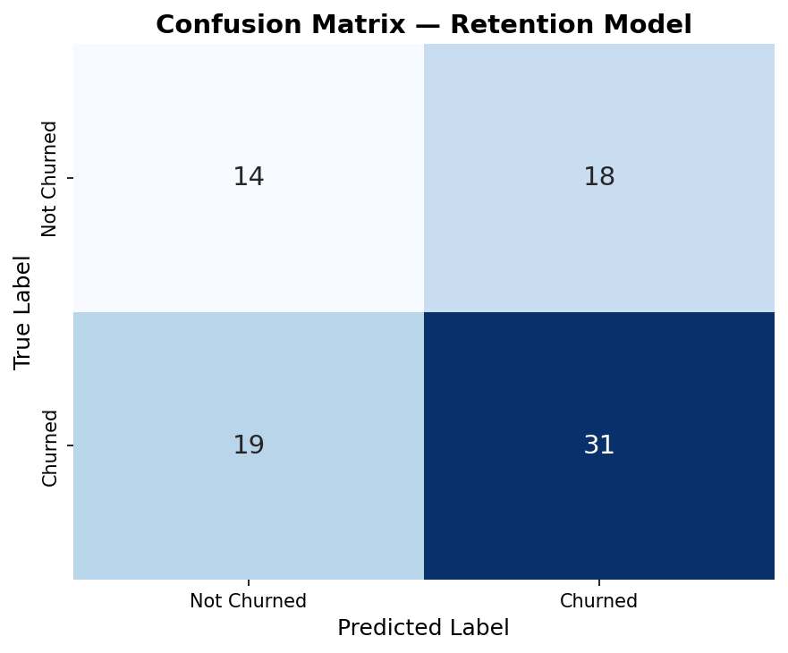
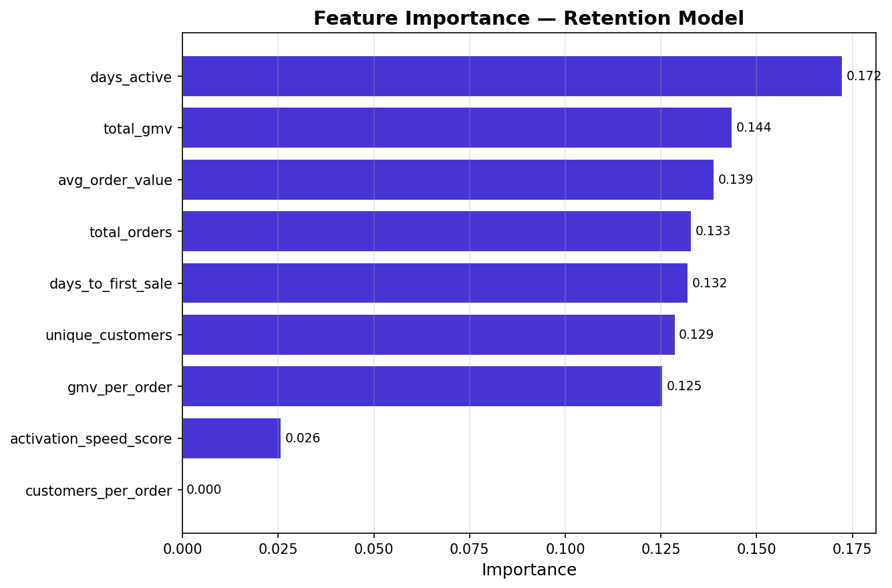

# Churn Prediction Models — Technical Evaluation Report

_Generated: 2026-02-19 14:58:52_

---

## Pre-Activation Model — Performance Metrics

- **Accuracy:** 0.919
- **Precision:** 0.924
- **Recall:** 0.946
- **F1 Score:** 0.935
- **ROC AUC:** 0.966

```
              precision    recall  f1-score   support

           0       0.91      0.88      0.89        82
           1       0.92      0.95      0.93       129

    accuracy                           0.92       211
   macro avg       0.92      0.91      0.91       211
weighted avg       0.92      0.92      0.92       211

```

### ROC Curve: Pre-Activation Model



### Precision-Recall Curve: Pre-Activation Model



### Confusion Matrix: Pre-Activation Model



### Feature Importance: Pre-Activation Model



## Retention Model — Performance Metrics

- **Accuracy:** 0.549
- **Precision:** 0.633
- **Recall:** 0.620
- **F1 Score:** 0.626
- **ROC AUC:** 0.577

```
              precision    recall  f1-score   support

           0       0.42      0.44      0.43        32
           1       0.63      0.62      0.63        50

    accuracy                           0.55        82
   macro avg       0.53      0.53      0.53        82
weighted avg       0.55      0.55      0.55        82

```

### ROC Curve: Retention Model



### Precision-Recall Curve: Retention Model



### Confusion Matrix: Retention Model



### Feature Importance: Retention Model


